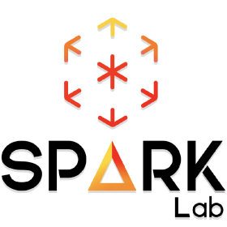
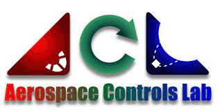
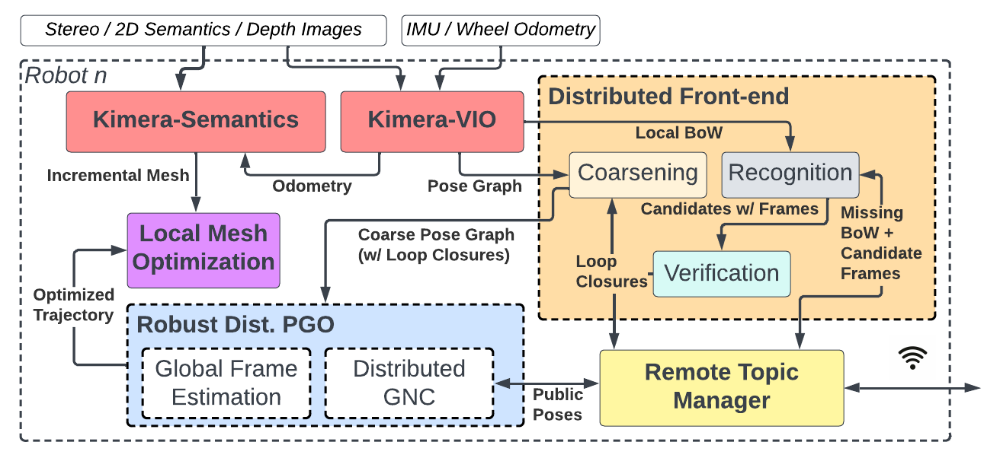

<div align="center">
  <a href="https://mit.edu/sparklab/">
    
  </a>
  <a href="https://mit.edu">
    
  </a>
  <a href="http://acl.mit.edu/">
    
  </a>
</div>

# Kimera-Multi

Kimera-Multi is a multi-robot system that 
(i) is robust and capable of identifying and rejecting incorrect inter and intra-robot loop closures resulting from perceptual aliasing, 
(ii) is fully distributed and only relies on local (peer-to-peer) communication to achieve distributed localization and mapping,
and (iii) builds a globally consistent metric-semantic 3D mesh model of the environment in real-time, where faces of the mesh are annotated with semantic labels. Kimera-Multi is implemented by a team of robots equipped with visual-inertial sensors. Each robot builds a local trajectory estimate and a local mesh using Kimera. When communication is available, robots initiate a distributed place recognition and robust pose graph optimization protocol based on a novel distributed graduated non-convexity algorithm. The proposed protocol allows the robots to improve their local trajectory estimates by leveraging inter-robot loop closures while being robust to outliers. Finally, each robot uses its improved trajectory estimate to correct the local mesh using mesh deformation techniques.

<p align="center">
    <a href="https://youtu.be/G8PktlQ82uw">
    
    </a>
</p>

## Installation

**Note**
The installation has only been tested on a team of robots with Ubuntu 18.04 and ROS Melodic.
Testing on Ubuntu 20.04 and ROS Noetic is currently ongoing.
```
# Create workspace
mkdir -p catkin_ws/src
cd catkin_ws/src/
git clone git@github.com:MIT-SPARK/Kimera-Multi.git kimera_multi

# If you do not have these dependencies already
sudo bash kimera_multi/install/dependencies.sh

# For full install
vcs import . --input kimera_multi/kimera_multi.repos --recursive

cd ..
# Configure build options and build!
catkin config -a --cmake-args -DCMAKE_BUILD_TYPE=RelWithDebInfo -DGTSAM_TANGENT_PREINTEGRATION=OFF -DGTSAM_BUILD_WITH_MARCH_NATIVE=OFF -DOPENGV_BUILD_WITH_MARCH_NATIVE=OFF
catkin build --continue -s
```

## System Architecture & Breakdown
<p align="center">
    <a href="https://arxiv.org/abs/2106.14386">
    
    </a>
</p>

For more in depth details about the system, we point the reader to our [paper](https://arxiv.org/abs/2106.14386).
Each robot runs an onboard system using the Robot Operating System (ROS). 
Inter-robot communication is performed in a fully peer-to-peer manner using a lightweight communication layer on top of the UDP protocol using the Remote Topic Manager. 
Kimera-VIO and Kimera-Semantics provide the odometric pose estimates and a reconstructed 3D mesh. 
The distributed front-end detects inter-robot loop closures by communicating visual Bag-of-Words (BoW) vectors and selected keyframes that contain keypoints and descriptors for geometric verification. 
The front-end is also responsible for incorporating the odometry and loop closures into a coarsened pose graph. 
The distributed back-end periodically optimizes the coarse pose graph using robust distributed optimization. Lastly, the optimized trajectory is used by each robot to correct its local 3D mesh.

### Module-to-Repository Directory
- [Kimera-Semantics](https://github.com/MIT-SPARK/Kimera-Semantics)
- [Kimera-VIO](https://github.com/MIT-SPARK/Kimera-VIO)
- Distributed Front-End: [Kimera-Distributed](https://github.com/MIT-SPARK/Kimera-Distributed) which handles the communication protocol and pose graph coarsening and [Kimera-Multi-LCD](https://github.com/MIT-SPARK/Kimera-Multi-LCD) which contains the functionalities for Bag-of-Words matching and keyframe registration.
- Remote Topic Manager: Coming Soon (Still in approval process).
- Robust Distributed PGO: [DPGO](https://github.com/mit-acl/dpgo) and [DPGO-ROS](https://github.com/mit-acl/dpgo_ros).
- Local Mesh Optimization: [Kimera-PGMO](https://github.com/MIT-SPARK/Kimera-PGMO).

## Examples & Usage

To test Kimera-Multi on a single machine, we provided an example in the examples folder.
First, install [tmuxp](https://github.com/tmux-python/tmuxp),
then, download the [Campus-Outdoor data](https://github.com/MIT-SPARK/Kimera-Multi-Data).
Lastly, run the following to launch all the processes for all 6 robots:
```bash
CATKIN_WS=<path-to-catkin-ws> DATA_PATH=<path-to-campus-outdoor-data-folder> LOG_DIR=<path-to-log-folder> tmuxp load 1014-example.yaml
```
Note that this example only uses a single ROS master, and will most likely not work with intermittent communication.
To run with separate ROS masters on separate machines, we will need to use the Remote Topic Manager,
which is currently under-going the approval process for release.
We will provide an additional example once the module is public.

## Citation

If you found Kimera-Multi to be useful, we would really appreciate if you could cite our work:

- [1] Y. Chang, Y. Tian, J. P. How and L. Carlone, "Kimera-Multi: a System for Distributed Multi-Robot Metric-Semantic Simultaneous Localization and Mapping," 2021 IEEE International Conference on Robotics and Automation (ICRA), Xi'an, China, 2021, pp. 11210-11218, doi: 10.1109/ICRA48506.2021.9561090.

```bibtex
@INPROCEEDINGS{chang21icra_kimeramulti,
  author={Chang, Yun and Tian, Yulun and How, Jonathan P. and Carlone, Luca},
  booktitle={2021 IEEE International Conference on Robotics and Automation (ICRA)}, 
  title={Kimera-Multi: a System for Distributed Multi-Robot Metric-Semantic Simultaneous Localization and Mapping}, 
  year={2021},
  volume={},
  number={},
  pages={11210-11218},
  doi={10.1109/ICRA48506.2021.9561090}
}

```

- [2] Y. Tian, Y. Chang, F. Herrera Arias, C. Nieto-Granda, J. P. How and L. Carlone, "Kimera-Multi: Robust, Distributed, Dense Metric-Semantic SLAM for Multi-Robot Systems," in IEEE Transactions on Robotics, vol. 38, no. 4, pp. 2022-2038, Aug. 2022, doi: 10.1109/TRO.2021.3137751.
```bibtex
@ARTICLE{tian22tro_kimeramulti,
  author={Tian, Yulun and Chang, Yun and Herrera Arias, Fernando and Nieto-Granda, Carlos and How, Jonathan P. and Carlone, Luca},
  journal={IEEE Transactions on Robotics}, 
  title={Kimera-Multi: Robust, Distributed, Dense Metric-Semantic SLAM for Multi-Robot Systems}, 
  year={2022},
  volume={38},
  number={4},
  pages={2022-2038},
  doi={10.1109/TRO.2021.3137751}
}

```

- [3] Y. Tian, Y. Chang, L. Quang, A. Schang, C. Nieto-Granda, J. P. How, and L. Carlone, "Resilient and Distributed Multi-Robot Visual SLAM: Datasets, Experiments, and Lessons Learned," arXiv preprint arXiv:2304.04362, 2023.
```bibtex
@ARTICLE{tian23arxiv_kimeramultiexperiments,
  author={Yulun Tian and Yun Chang and Long Quang and Arthur Schang and Carlos Nieto-Granda and Jonathan P. How and Luca Carlone},
  title={Resilient and Distributed Multi-Robot Visual SLAM: Datasets, Experiments, and Lessons Learned},
  year={2023},
  eprint={2304.04362},
  archivePrefix={arXiv},
  primaryClass={cs.RO}
}
```

## Datasets

We have also released some [real-life datasets](https://github.com/MIT-SPARK/Kimera-Multi-Data) collected on 8 robots on the MIT campus.

## Acknowledgements
Kimera-Multi was supported in part by ARL [DCIST](https://www.dcist.org), [ONR](https://www.nre.navy.mil/), and [MathWorks](https://www.mathworks.com/).
